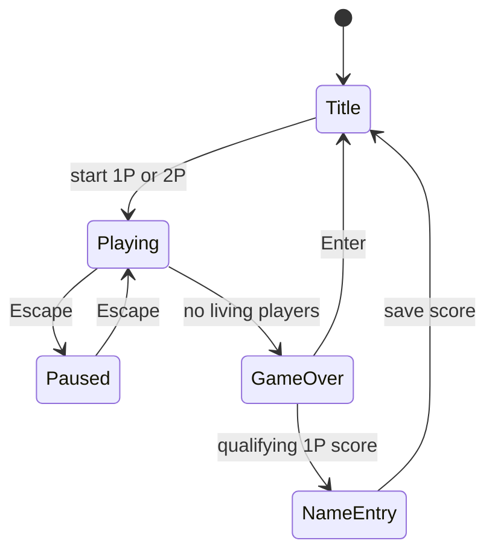

# NS-SHAFT 1.3J Reverse-Engineering Notes

## Evidence Policy

Facts are labeled as:

- **Confirmed:** directly stated by original documentation or observable in the binary.
- **Inferred:** supported by static analysis but not yet measured dynamically.
- **Provisional:** selected for the playable reconstruction and awaiting emulator comparison.

The browser implementation is a clean-room behavioral reconstruction. No decompiled
source is copied into the TypeScript implementation.

## Confirmed Product Structure

- Windows release: PE32 i386 GUI executable, timestamp 1997-09-17.
- Runtime APIs: Win32 USER/GDI, timers, DIB rendering, WAV playback and MCI MIDI.
- External files: `BGM.MID`, `NSSHAFT.HLP`, `NSSHAFT.CNT`.
- Persistent file: `NSSHAFT.INI`, containing version, registration, records, last
  entered name, difficulty, platform-feature flags, music, sound and speed mode.
- Modes: one player and simultaneous local two player.
- Controls: player one uses Left/Right; player two uses Z/X; Escape pauses.
- Difficulty levels: easy, normal and hard. Difficulty changes platform patterns
  and scrolling speed.
- Optional platform types: conveyor, springboard and rotating platform.
- Normal platforms restore health. Floor spikes and the descending ceiling spikes
  remove health. Falling below the screen or reaching zero health ends that player.
- Two-player play continues while either player remains alive and does not register
  a high score.

## Browser Simulation Baseline

The constants in `src/game/simulation.ts` and `src/game/difficulty.ts` intentionally
remain isolated and deterministic. Their relative ordering follows the original
manual; their exact numeric values require frame capture in Windows 95/NT and classic
Macintosh emulation.

| Parameter | Status | Current baseline |
| --- | --- | --- |
| Maximum substep | iPel-aligned | 20 ms |
| Native frame | Confirmed resource | 634 x 436 |
| Playfield | Measured in resource 106 | 420 x 356 at (22, 62) |
| Maximum health | iPel-aligned | 10 |
| Normal landing heal | iPel-aligned | +1 |
| Spike landing damage | Confirmed behavior | -5 |
| Horizontal control | iPel-aligned | 0.2 px/ms |
| Gravity | iPel-aligned | 0.0015 px/ms² |
| Platform gap | iPel-aligned | 60 px |
| Scroll velocity | Provisional by difficulty | -0.06/-0.08/-0.10 px/ms |

## Windows Bitmap Map

| Resource | Dimensions | Identified purpose |
| --- | ---: | --- |
| 101 | 544 x 400 | Main sprite sheet: players, platforms, digits, spikes, pause/game-over text |
| 102 | 128 x 128 | Blue shaft-wall texture |
| 103 | 384 x 232 | Monochrome sprite masks |
| 104 | 288 x 140 | NS-SHAFT Ver 1.3J title artwork |
| 105 | 288 x 140 | Copyright/programming panel |
| 106 | 634 x 436 | Difficulty and record dialog artwork |

## Native Gameplay Layout

The gameplay renderer uses the Windows assets at their original pixel dimensions:

- LIFE label at `(71,12)` and the 11 native 96 x 16 health-bar states at `(46,28)`.
- Floor prefix at `(194,12)`, four unscaled 32 x 32 digits from `(262,12)`,
  and the floor suffix at `(374,12)`.
- The 128 x 128 rock texture tiles across the complete 420 x 356 playfield.
- The 16 x 32 wall tile repeats at playfield-local `x=0` and `x=400`.
- The complete 384 x 16 ceiling-spike strip draws once at local `(16,0)`.
- Difficulty labels and four small record digits are drawn from bitmap 101;
  browser fonts are not used inside the gameplay cabinet.

These positions were measured against the Windows 1.3J reference screenshot and
cross-checked with the 1.2J gameplay recording.

## Packed Sprite Segmentation

Bitmap 101 is a packed resource, not a uniform tile grid. Empty space is reused
and adjacent objects have different heights. Browser derivatives are therefore
built from explicit rectangles and separated by transparent padding.

| Object | Source rectangles in bitmap 101 |
| --- | --- |
| Character poses | Four 20-frame groups, each 32 x 32: yellow, yellow hurt/red, green, green hurt/red |
| Normal floor | Blue `(288,0,96,16)` |
| Conveyor rail right | Four grey 96 x 16 frames at `x=288`, `y=16,32,48,64`; pushes right |
| Conveyor rail left | Four grey 96 x 16 frames at `x=288`, `y=80,96,112,128`; pushes left |
| Rotating/disappearing floor | Stone frames at `x=288`; heights `10,29,36,32,35,30`; never pushes the player |
| Spring | 96 px wide; heights `23,21,20,18,16,14,12` |
| Spike floor | `(384,368,96,32)` |

The spring uses all seven native frames. Contact compresses from frame 0 to
frame 6 over 200ms; the player launches at full compression; frames 5 back to 0
restore the spring over the following 100ms.

Bitmap 103 supplies the monochrome character mask.
`tools/build_native_sprite_sheet.py` creates a transparent 544 x 400 derivative
without moving or resizing any element: all source rectangles remain at their
bitmap-101 coordinates. It flood-fills only border-connected black pixels for
objects, preserving enclosed black detail.

## State Machine



## Reproduction Commands

```bash
npm run research
python3 -m pip install pefile
npm run extract:windows
npm run assets:web
npm run assets:characters
npm run assets:objects
npm test
npm run test:browser
npm run test:cross-browser
sh tools/unpack_mac.sh
```

`tools/unpack_mac.sh` first decodes the BinHex envelope. Continuing through StuffIt
requires `unar`, because preservation of the Macintosh data and resource forks is
mandatory.

## Behavioral Reference

The standing-on-platform, walking-off-platform and time-based gravity model was
cross-checked against the Apache-2.0 project
[`iPel/NS-SHAFT`](https://github.com/iPel/NS-SHAFT). The implementation in this
repository remains TypeScript-specific and uses the authorized Windows 1.3J assets.
Attribution is recorded in the repository `NOTICE`.
