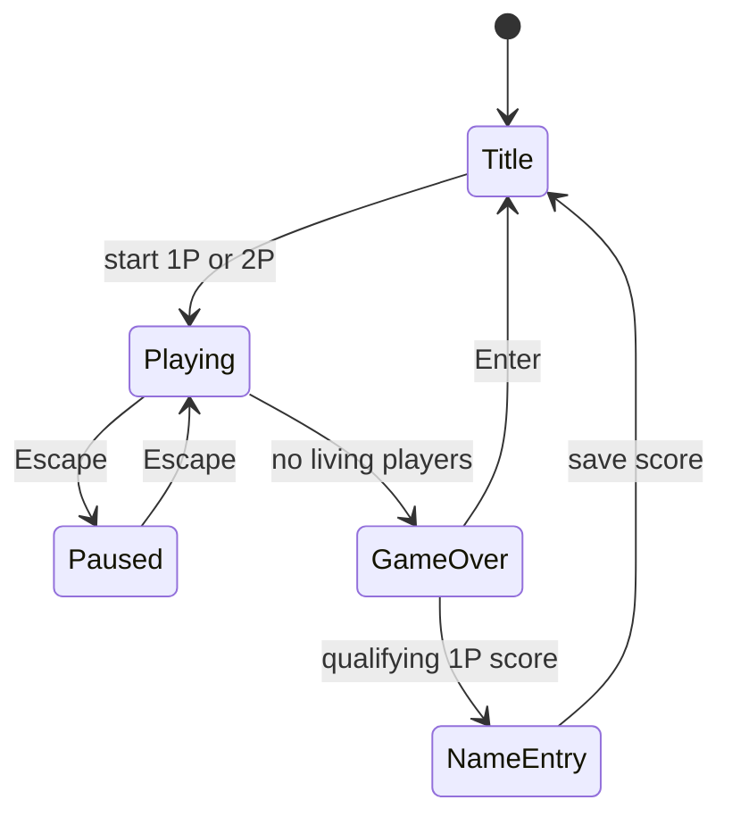

# NS-SHAFT 1.3J Reverse-Engineering Notes

## Evidence Policy

Facts are labeled as:

- **Confirmed:** directly stated by original documentation or observable in the binary.
- **Inferred:** supported by static analysis but not yet measured dynamically.
- **Provisional:** selected for the playable reconstruction and awaiting emulator comparison.

The browser implementation is a clean-room behavioral reconstruction. No decompiled
source is copied into the TypeScript implementation.

## Confirmed Product Structure

- Windows release: PE32 i386 GUI executable, timestamp 1997-09-17.
- Runtime APIs: Win32 USER/GDI, timers, DIB rendering, WAV playback and MCI MIDI.
- External files: `BGM.MID`, `NSSHAFT.HLP`, `NSSHAFT.CNT`.
- Persistent file: `NSSHAFT.INI`, containing version, registration, records, last
  entered name, difficulty, platform-feature flags, music, sound and speed mode.
- Modes: one player and simultaneous local two player.
- Controls: player one uses Left/Right; player two uses Z/X; Escape pauses.
- Difficulty levels: easy, normal and hard. Difficulty changes platform patterns
  and scrolling speed.
- Optional platform types: conveyor, springboard and rotating platform.
- Normal platforms restore health. Floor spikes and the descending ceiling spikes
  remove health. Falling below the screen or reaching zero health ends that player.
- Two-player play continues while either player remains alive and does not register
  a high score.

## Browser Simulation Baseline

The constants in `src/game/simulation.ts` and `src/game/difficulty.ts` intentionally
remain isolated and deterministic. Their relative ordering follows the original
manual; their exact numeric values require frame capture in Windows 95/NT and classic
Macintosh emulation.

| Parameter | Status | Current baseline |
| --- | --- | --- |
| Maximum substep | iPel-aligned | 20 ms |
| Native frame | Confirmed resource | 634 x 436 |
| Playfield | Measured in resource 106 | 420 x 356 at (22, 62) |
| Maximum health | Windows screenshot aligned | 12 |
| Normal landing heal | iPel-aligned | +1 |
| Spike landing damage | Confirmed behavior | -5 |
| Horizontal control | iPel-aligned | 0.2 px/ms |
| Gravity | iPel-aligned | 0.0015 px/ms² |
| Platform gap | iPel-aligned | 60 px |
| Scroll velocity | Provisional by difficulty | -0.06/-0.08/-0.10 px/ms |

## Windows Bitmap Map

| Resource | Dimensions | Identified purpose |
| --- | ---: | --- |
| 101 | 544 x 400 | Main sprite sheet: players, platforms, digits, spikes, pause/game-over text |
| 102 | 128 x 128 | Blue shaft-wall texture |
| 103 | 384 x 232 | Monochrome sprite masks |
| 104 | 288 x 140 | NS-SHAFT Ver 1.3J title artwork |
| 105 | 288 x 140 | Copyright/programming panel |
| 106 | 634 x 436 | Difficulty and record dialog artwork |

## Native Gameplay Layout

The gameplay renderer uses the Windows assets at their original pixel dimensions:

- LIFE label at `(71,12)` and the 12 native 96 x 16 health-bar states at `(46,28)`.
- Floor prefix at `(194,12)`, four unscaled 32 x 32 digits from `(262,12)`,
  and the floor suffix at `(382,12)`.
- The 128 x 128 rock texture tiles across the complete 420 x 356 playfield.
- The 16 x 32 wall tile repeats at playfield-local `x=0` and `x=400`.
- The complete 384 x 16 ceiling-spike strip draws once at local `(16,0)`.
- Difficulty labels and four small record digits are drawn from bitmap 101;
  browser fonts are not used inside the gameplay cabinet.

These positions were measured against the Windows 1.3J reference screenshot and
cross-checked with the 1.2J gameplay recording. The difficulty labels are tight
right-aligned crops from the packed row in bitmap 101, because wider crops include
neighboring Japanese text fragments.

The floor text row is also packed tightly. `地下` is rendered from two audited
source rectangles, `地=(128,320,36,32)` and `下=(166,320,34,32)`, rather than a
single guessed grid cell. `階=(196,320,40,32)` includes the complete green/yellow
right edge; the next source column at `x=236` is already the magenta `1P` artwork,
so extending the crop would import a neighboring element. These bounds are
recorded by `tools/audit_sprite_boundaries.py`.

## Packed Sprite Segmentation

Bitmap 101 is a packed resource, not a uniform tile grid. Empty space is reused
and adjacent objects have different heights. Browser derivatives are therefore
built from explicit rectangles and separated by transparent padding.

| Object | Source rectangles in bitmap 101 |
| --- | --- |
| Character poses | Four 20-frame groups, each 32 x 32: yellow, yellow hurt/red, green, green hurt/red |
| Normal floor | Blue `(288,0,96,16)` |
| Conveyor rail right | Four grey 96 x 16 frames at `x=288`, `y=16,32,48,64`; pushes right |
| Conveyor rail left | Four grey 96 x 16 frames at `x=288`, `y=80,96,112,128`; pushes left |
| Rotating/disappearing floor | Stone frames at `x=288`; heights `10,29,36,32,35,30`; never pushes the player |
| Spring | 96 px wide; heights `23,21,20,18,16,14,12` |
| Spike floor | `(384,368,96,32)` |

The spring uses all seven native frames. Contact compresses from frame 0 to
frame 6 over 100ms; the player launches at full compression; frames 5 back to 0
restore the spring over the following 100ms. This timing remains a playability
calibration rather than a frame-exact Windows 1.3J measurement.

Bitmap 103 supplies the monochrome character mask.
`tools/build_native_sprite_sheet.py` creates a transparent 544 x 400 derivative
without moving or resizing any element: all source rectangles remain at their
bitmap-101 coordinates. It flood-fills only border-connected black pixels for
objects, preserving enclosed black detail.

## State Machine



## Online 2P Architecture

Online 2P is implemented as a browser-native extension around the deterministic
simulation rather than a new ruleset. The host creates a Firebase Realtime
Database room under `/ns-shaft/rooms` with a four-digit numeric code, mode, selected difficulty,
mechanism flags and a shared seed. The guest joins the same room and both
players press Ready before the host starts a five-second countdown using the
Firebase server-time offset. The room lifecycle is `lobby -> countdown ->
playing -> results -> lobby`; each new round receives a fresh seed.

Co-op rooms write each browser's local left/right/pause input for every tick.
`OnlineLockstepController` waits for both players' inputs at a fixed delay and
then advances the shared two-player `GameSimulation`. A dead player remains in
the simulation long enough for gravity to carry the body below the playfield;
the surviving player continues and the shared game ends only when nobody is
alive.

Split Race rooms run one independent one-player simulation per browser. The
local cabinet remains at the original 634x436 size while the opponent cabinet
is rendered at an exact 317x218 CSS size. Renderer color override makes the
remote character use the original green 2P frames without mutating synchronized
simulation state. Local
input advances immediately, while a detached renderer-safe `RaceSnapshot` is
written every six ticks (about 100ms) and rendered on the opponent canvas.
Remote snapshot delay never blocks local simulation. Rendering keeps the two
latest remote snapshots and interpolates them behind a 100ms local-time buffer;
stale packets are discarded and authoritative result checks continue to use the
latest uninterpolated snapshot. Only local events feed the audio system. Both
online modes keep the Windows 1.3J assets and rules as their behavioral base,
and completed runs submit to the namespaced Firebase global Best 5.

Normal completion does not leave the room. Co-op waits until both players are
dead; Split Race lets a finished player spectate until both runs finish. The
host publishes a three-second results phase, then clears both Ready flags and
returns the same room to its lobby with mode, difficulty and mechanisms intact.

The lobby locks mode/name/code controls after entering a room, shows distinct
waiting/connected/ready rows for P1 and P2, and keeps Ready as an explicit local
action. Room creation first attempts a Clipboard API write and retains a manual
`Copy Code` fallback if browser permission is unavailable.

Firebase configuration is read only from local Vite environment variables
(`.env.local`). The repository includes `.env.example` but no project keys.
Anonymous Authentication must be enabled. `database.rules.json` closes the old
root paths, limits rooms to four-digit codes, and makes leaderboard submissions
authenticated, append-only, schema-validated, and indexed by floor.

## Reproduction Commands

```bash
npm run research
python3 -m pip install pefile
npm run extract:windows
npm run assets:web
npm run assets:characters
npm run assets:objects
npm test
npm run test:browser
npm run test:cross-browser
npm run test:firebase-rules
npm run test:firebase-browser
# With the dev server running on port 5175 and local Firebase env configured:
npm run test:firebase
sh tools/unpack_mac.sh
```

`tools/unpack_mac.sh` first decodes the BinHex envelope. Continuing through StuffIt
requires `unar`, because preservation of the Macintosh data and resource forks is
mandatory.

## Behavioral Reference

The standing-on-platform, walking-off-platform and time-based gravity model was
cross-checked against the Apache-2.0 project
[`iPel/NS-SHAFT`](https://github.com/iPel/NS-SHAFT). The implementation in this
repository remains TypeScript-specific and uses the authorized Windows 1.3J assets.
Attribution is recorded in the repository `NOTICE`.
